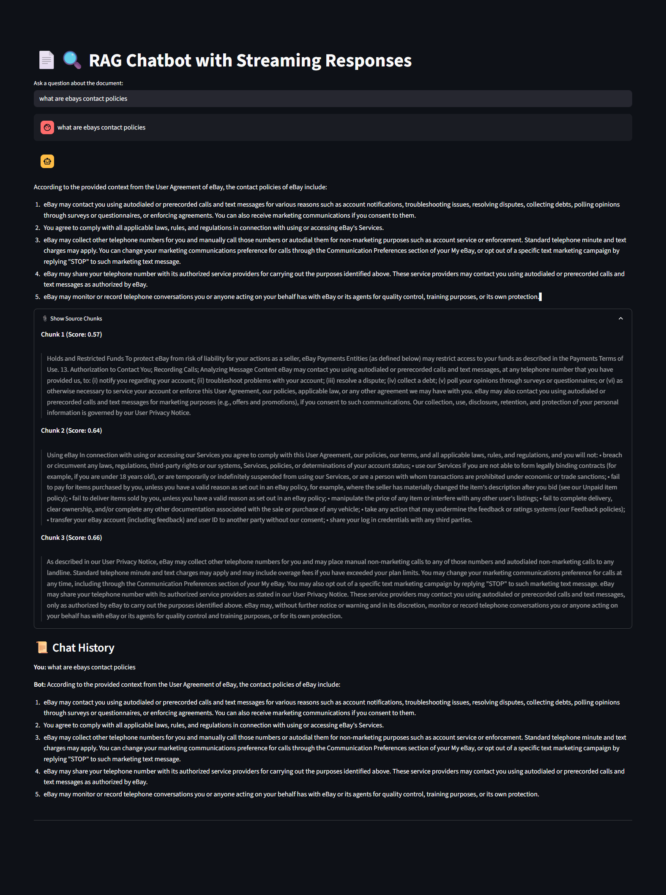
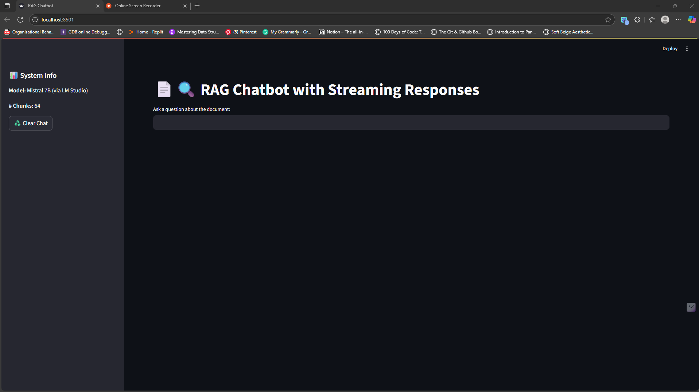
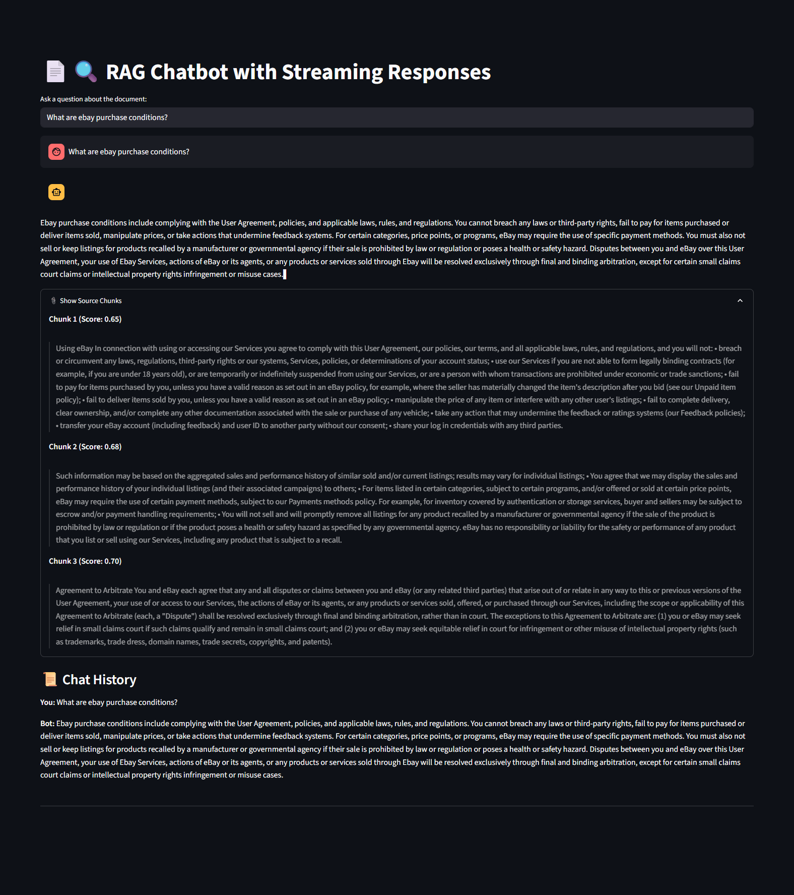

# 🧠 Fine-Tuned RAG Chatbot with Streaming Responses

An end-to-end Retrieval-Augmented Generation (RAG) chatbot that can answer user queries based on a legal or policy document. This project integrates document chunking, semantic search using vector databases, local LLM generation via LM Studio, and a Streamlit chatbot interface with real-time streaming.

---

## 📌 Overview

- **Input:** Any legal text document (e.g., Privacy Policy, Terms & Conditions)
- **Output:** Chatbot answers based on retrieved, relevant document chunks
- **Technologies Used:** SentenceTransformers, FAISS, LM Studio (Mistral), Streamlit
- **Hardware:** Runs locally on GPU (tested on GTX 1650)

---

## 🗺️ Architecture

```mermaid
flowchart TD
    A[PDF Document] --> B[Preprocessing & Chunking]
    B --> C[Embedding with MiniLM]
    C --> D[FAISS Vector Store]
    E[User Query] --> F[Retriever]
    D --> F
    F --> G[Top-k Chunks]
    G --> H[Prompt Builder]
    H --> I[LLM (via LM Studio)]
    I --> J[Streaming UI in Streamlit]
````

---

## 📂 Project Structure

```
rag-chatbot/
├── data/             # Raw input documents
├── chunks/           # Cleaned & chunked documents
├── vectordb/         # FAISS index
├── notebooks/        # Preprocessing & testing scripts
├── src/              # Core logic: retriever, generator, preprocess
├── app.py            # Streamlit app
├── requirements.txt
└── README.md         # This file
```

---

## ⚙️ Setup Instructions

### 🔧 1. Environment Setup

```bash
git clone https://github.com/Meh15ak/rag-chatbot.git
cd rag-chatbot
python -m venv ragenv
source ragenv/bin/activate  # Windows: ragenv\Scripts\activate
pip install -r requirements.txt
```

### 📄 2. Add Your Document

Place your `.pdf` file into the `data/` directory.

### 🔍 3. Run Preprocessing

This will extract text, chunk it, embed using MiniLM, and create a FAISS index.

```bash
python notebooks/run_preprocess.py
```

✅ Output:

* `chunks/`: contains all document chunks
* `vectordb/`: contains FAISS index

### 🤖 4. Start LM Studio

1. Open [LM Studio](https://lmstudio.ai/)
2. Load a **chat-optimized model** such as `mistral-7b-instruct` or `zephyr-7b`
3. Make sure the local server is running at:
   `http://localhost:1234`

---

### 🧪 5. Test RAG Flow

```bash
python notebooks/test_rag_end_to_end.py
```

You’ll see:

* Top retrieved chunks
* Final prompt
* Model’s generated answer

---

### 💬 6. Run Streamlit Chatbot (With Streaming)

```bash
streamlit run app.py
```

Features:

* Real-time response streaming
* Displays relevant source chunks
* Sidebar info: current model, number of chunks
* Reset/clear chat button

---

## 🧠 Embedding & Model Details

| Component        | Choice                              |
| ---------------- | ----------------------------------- |
| **Embedding**    | `all-MiniLM-L6-v2` (HuggingFace)    |
| **Vector Store** | FAISS (cosine similarity)           |
| **LLM**          | `mistral-7b-instruct` via LM Studio |
| **Chunk Size**   | \~150–300 words (sentence-aware)    |
| **Top-K Chunks** | 3                                   |

---

## 📝 Prompt Format

```text
You are a helpful assistant. Use only the context below to answer the question.

Context:
Chunk 1: ...
Chunk 2: ...
Chunk 3: ...

Question: ...
```

---

## 📷 Screenshots

| Chat Example                      | Streaming UI                      |
| --------------------------------- | --------------------------------- |
|  |  |

 
---

## 🎥 Demo Video

[Watch demo video](scrrenshots/recorder_screen.webm)

---

## 📘 PDF Report Summary

### 1. Preprocessing & Chunking

* Used NLTK to split \~10,500+ words into 64 chunks
* Cleaned encoding issues and metadata
* Stored in `chunks/` directory

### 2. Embedding & Retrieval

* Used `all-MiniLM-L6-v2` for embeddings
* Stored in FAISS DB with cosine similarity
* Retrieved top-3 relevant chunks

### 3. Prompt Format & Generation

* Retrieved chunks + query → injected into prompt
* Model: `mistral-7b-instruct` via LM Studio
* Token-by-token streaming to UI

### 2. Outputs

| Query                 | Response                              |
| --------------------- | ------------------------------------- |
| eBay’s contact policy | Correct legal clause on autodialing   |
| Marketing permissions | Accurate section with user consent    |
| Refund info           | No direct answer (handled gracefully) |


---

## 👨‍💻 Author

**Arshad Jamal**
🧪 Passionate about NLP, Open-Source LLMs, and AI Products

---

